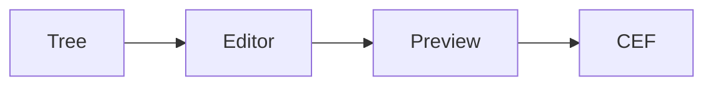

# DragonMarkdown Demo

This folder exercises the v1 preview surface.

## Task List

- [x] Folder tree
- [x] Tabbed editor
- [x] Rich preview
- [ ] Local asset handler

## Table

| Feature | Status |
| --- | --- |
| Markdig rendering | Ready |
| Mermaid hooks | Ready |
| MathJax hooks | Ready |

## Mermaid



## Math

Inline math: \(a^2 + b^2 = c^2\)

\[
E = mc^2
\]

## Code

```csharp
Console.WriteLine("DragonMarkdown");
```

## Asset


