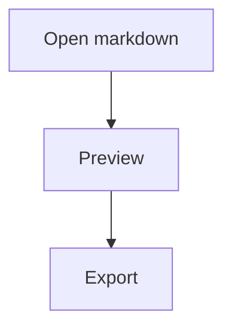

# DragonMarkdown Help

DragonMarkdown is a desktop markdown editor with a workspace tree, source editor, and live preview.

## Opening Work

- Use **File > Open Folder** to load a folder into the workspace tree.
- Use **File > Open File** to open a single markdown document.
- You can also launch the app with a path argument, such as `DragonMarkdown.App.exe C:\docs\project`.

## Editing And Preview

- Select a markdown file in the workspace tree to open it.
- Use **View > Editor** or **View > Preview** to hide either pane.
- When one document pane is hidden, the remaining pane expands while the workspace tree stays visible.

## Exporting

- Use **File > Export to Word** to create a `.docx` file from the active markdown document.
- Use **File > Export to PDF** to create a `.pdf` file from the active markdown document.
- Mermaid `graph` and `flowchart` code fences are rendered into diagrams for export.

## Mermaid Example

